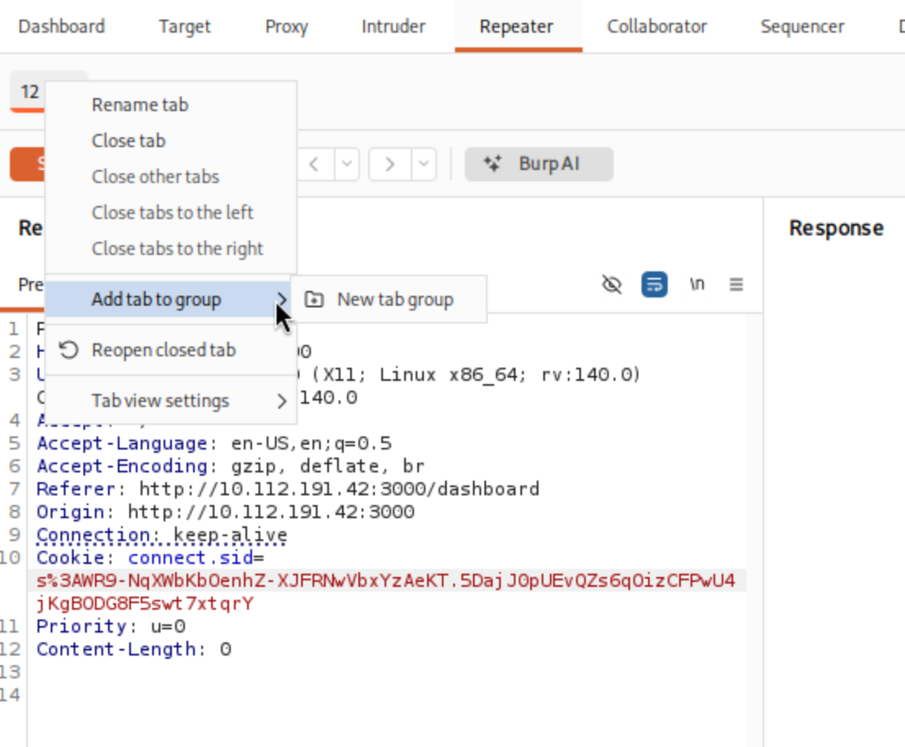
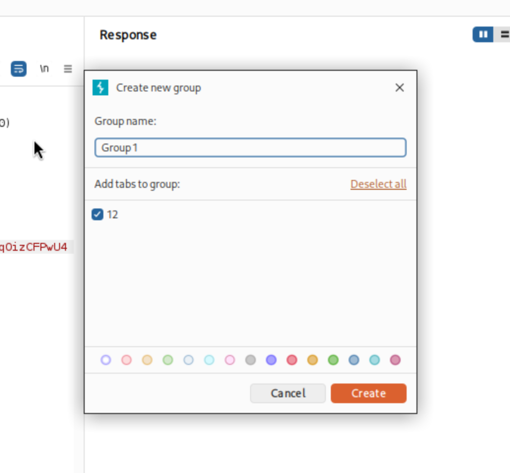
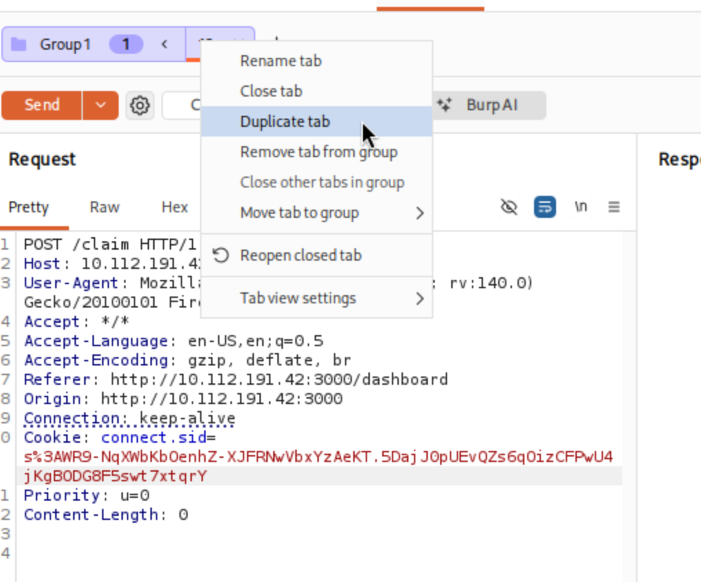
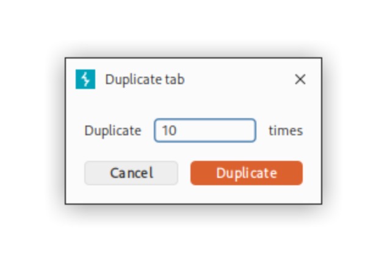
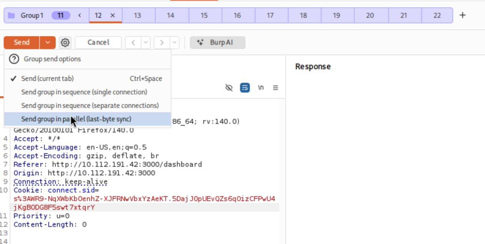
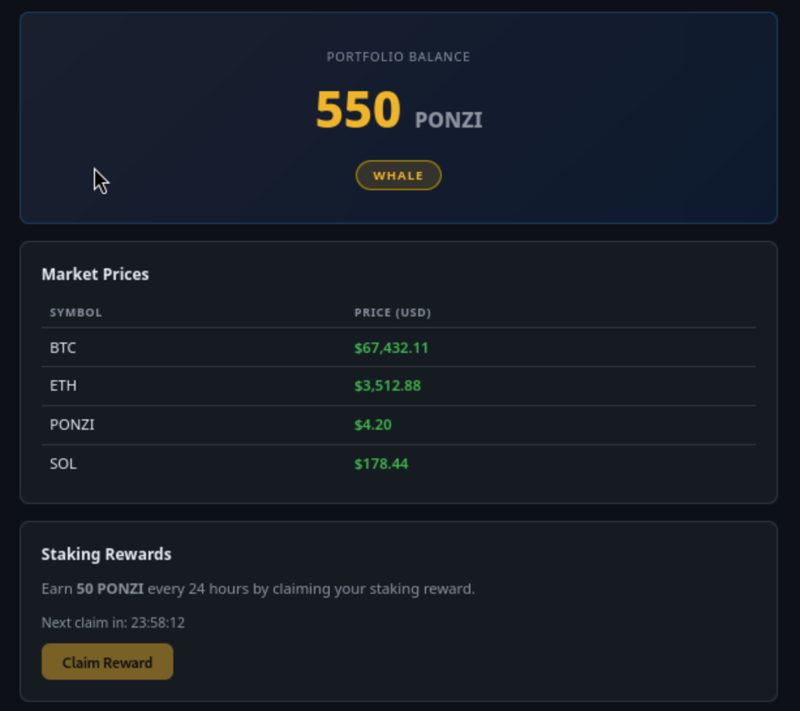
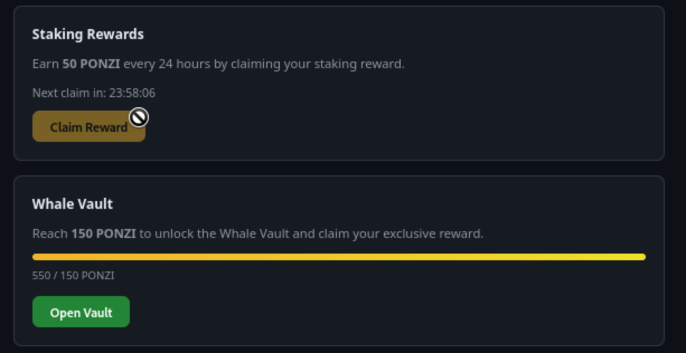

# TryHackMe — Hacker Holidays 2026
## Day 8: [Towel on the Sunbed](https://tryhackme.com/room/hh-towelonthesunbed-61271709)

**Platform:** [TryHackMe](https://tryhackme.com)  
**Category:** Web Exploitation / Business Logic / Burp Suite / API Abuse  
**Difficulty:** Medium  
**Status:** Complete — flag recovered

---

## Description

Ponzi found the resort's wellness portal running a crypto rewards app called *Ponzi Portfolio*. The app lets users claim **50 PONZI** every 24 hours. Accumulate **150 PONZI** to unlock the **Whale Vault** and retrieve the flag. The challenge: find a way to claim the reward multiple times before the server's cooldown kicks in.

## Attack chain overview

Before diving into the commands, here is the map of the full attack:

1. **Recon** → identify open ports and the web application running on port 3000.
2. **App exploration** → register an account, understand the reward mechanism and the Whale Vault threshold.
3. **Race condition discovery** → understand why the server is vulnerable: it checks eligibility and updates state in two separate, non-atomic steps.
4. **Race condition exploit via Burp Suite** → register a fresh account, intercept `POST /claim`, duplicate it 10 times in a Repeater group, and send them all simultaneously with **last-byte sync**.
5. **Flag retrieval** → balance reaches 550 PONZI, Whale Vault unlocks, flag recovered.

---

## Step 1 — Reconnaissance

```bash
nmap -sV -sC -A -p- <target_ip>
```

**Flag/options used:**
- `-sV` → **service version detection**: instead of just noting "port is open", Nmap tries to identify the exact software and version on each port (e.g. "Node.js Express framework").
- `-sC` → **default scripts**: runs built-in Nmap scripts for extra checks like banner grabbing and page title detection.
- `-A` → **aggressive scan**: combines OS detection, version detection, script scanning, and traceroute in one pass.
- `-p-` → **all 65535 ports**: by default Nmap scans only the 1000 most common ports; this flag forces a full scan so nothing is missed.

**Output (relevant):**

```text
PORT     STATE  SERVICE  VERSION
22/tcp   open   ssh      OpenSSH 9.6p1 Ubuntu
3000/tcp open   http     Node.js Express framework
| http-title: Ponzi Portfolio — Login
```

**Explanation:** two ports are open:
- **Port 22 (SSH)** → remote shell access. Not our entry point here, but worth noting in case credentials emerge later.
- **Port 3000 (HTTP)** → a **Node.js / Express** web application titled "Ponzi Portfolio". The server immediately redirects unauthenticated visitors to `/auth/login`. This is our target.

---

## Step 2 — Setting up Burp Suite and FoxyProxy

Before navigating to the app, we route the browser's traffic through **Burp Suite** so we can intercept, read, and replay every HTTP request.

1. Open **Burp Suite** → **Settings** → **Proxy → Proxy listeners** → confirm it listens on `127.0.0.1:8080`.
2. In Firefox, activate **FoxyProxy** pointing to `127.0.0.1:8080`.

> **What is Burp Suite?** A web security testing platform. Its core feature is an **intercepting proxy**: it sits between your browser and the target server, letting you capture and modify every request before it is sent. Think of it as a wiretap on your own browser traffic.

> **What is FoxyProxy?** A Firefox extension that switches the browser proxy on/off with one click, without touching system settings.

---

## Step 3 — Register a guest account and explore the dashboard

Navigate to `http://<target_ip>:3000/auth/register`. Fill in the form. Burp intercepts the registration request:

```http
POST /auth/register HTTP/1.1
Host: <target_ip>:3000
Content-Type: application/json

{"username":"guest00","password":"test1234"}
```

**Explanation:** the registration form sends a `POST` to `/auth/register` with a JSON body. The server creates the account and returns a **session cookie** (`connect.sid`). This cookie is our identity for every subsequent request — without it the server treats us as unauthenticated.

After forwarding the request, the browser lands on the **dashboard**. Key elements visible on the page:

- **Portfolio Balance** → starts at **0 PONZI**.
- **Tier badge** → starts as **Shrimp** (lowest tier).
- **Staking Rewards card** → one button: *Claim Reward*, awards **+50 PONZI**, available **once every 24 hours**.
- **Whale Vault card** → locked until balance reaches **150 PONZI**. The flag lives here.

**The maths:** to reach 150 PONZI legitimately you need 3 claims = **3 days of waiting**. The challenge wants us to bypass this.

---

## Step 4 — Intercept the Claim Reward request

Click the **Claim Reward** button in the browser. Burp intercepts:

```http
POST /claim HTTP/1.1
Host: <target_ip>:3000
Cookie: connect.sid=s%3ATh-MsLRmzQX6ftTxva5Jtsl8ukRZZlSf.nfygl%2B9fvH%2B%2BguVs8KOHtuN83x7rFfD%2FR9Getm1Uv2M
Content-Length: 0
```

**Explanation:** the claim has no body at all. The server reads the `connect.sid` cookie to identify who is claiming. After a successful claim it:
1. credits **+50 PONZI** to the account;
2. records the current time as `lastClaimAt`;
3. blocks further claims for 24 hours.

The critical question: **is this check-and-update atomic?** If the server reads "can this user claim?" and writes "this user has now claimed" in two separate steps, a tiny window exists where two concurrent requests can both pass the check before either one has finished the update.

> **What is "atomic"?** An operation is atomic if it is indivisible — either it completes entirely, or it does not happen at all. A database `UPDATE ... WHERE` that checks and modifies in one instruction is atomic. Two separate `SELECT` + `UPDATE` calls are not — another request can slip in between them.

---

## Step 5 — Create a fresh account for the exploit

The account `guest00` has already consumed its claim. We need a clean account where `canClaim` is still `true`. Log out and register a new one via the browser (Burp intercepts again):

```http
POST /auth/register HTTP/1.1
Host: <target_ip>:3000
Content-Type: application/json

{"username":"guest01","password":"test1234"}
```

Note the **new `connect.sid`** value from the `Set-Cookie` response header — this is the cookie for `guest01`, and it is the one we will use in all the parallel claim requests.

```
connect.sid=s%3AWR9-NqXWbKbOenhZ-XJFRNwVbxYzAeKT.5DajJ0pUEvQZs6qOizCFPwU4jKgB0DG8F5swt7xtqrY
```

---

## Step 6 — Set up the race condition attack in Burp Repeater

### 6.1 Send the claim request to Repeater

In **Proxy → HTTP history**, find the earlier `POST /claim` request (from `guest00`). Right-click → **Send to Repeater**.

In the Repeater tab, **replace the old `connect.sid`** cookie with the new one from `guest01` (the fresh account).

> **What is Burp Repeater?** A tool that lets you manually resend any HTTP request as many times as you want, modifying it each time. It is useful for experimenting with requests without going through the browser.

### 6.2 Add the tab to a new group

Right-click on the Repeater tab → **Add tab to group** → **New tab group**.



A dialog appears. Name the group (e.g. `Group 1`) and confirm with **Create**.



> **Why a group?** Burp's "Send group" feature lets you fire multiple Repeater tabs simultaneously. Without a group, you can only send tabs one at a time.

### 6.3 Duplicate the tab 10 times

Inside the group, right-click on the tab → **Duplicate tab**.



In the dialog, enter **10** and click **Duplicate**.



You now have **10 identical tabs** in the group, each containing the same `POST /claim` request with `guest01`'s cookie. All 10 will try to claim a reward at the same instant.

> **Why 10 tabs and not just 2 or 3?** The race window is very small — maybe just a few milliseconds. More concurrent requests means more chances that at least 3 of them pass the "canClaim: true" check before the server finishes updating the state. 10 is a practical balance.

### 6.4 Send the group in parallel with last-byte sync

Click the **dropdown arrow** next to the Send button → select **Send group in parallel (last-byte sync)**.



**Explanation of the send options:**
- **Send (current tab)** → sends only the active tab, one at a time. Useless for a race attack.
- **Send group in sequence (single connection)** → sends all tabs one after another on the same TCP connection. Still sequential — no race possible.
- **Send group in sequence (separate connections)** → opens a separate TCP connection per tab, but still sends them in order. Better, but still sequential.
- **Send group in parallel (last-byte sync)** → this is the key option. Burp opens all connections simultaneously, sends each request up to the very last byte, then releases the final byte on all of them **at the same instant**. This is the **single-packet attack** / **last-byte sync** technique: it minimises the time gap between when the server starts processing each request, maximising the chance of hitting the race window on all of them.

> **Why "last-byte sync"?** TCP connections have setup overhead. By preparing all requests and sending everything except the final byte first, then releasing the last byte on all connections together, Burp ensures the server receives all requests within microseconds of each other — far too fast for the "mark as claimed" update to have propagated between them.

---

## Step 7 — Result: 550 PONZI and Whale status

After the parallel send, refresh the dashboard in the browser:



The balance jumped to **550 PONZI** and the tier badge now reads **WHALE**. Multiple claims went through simultaneously before the server could update the "already claimed" flag.

> **Why 550 and not exactly 150?** With 10 parallel requests, more than 3 claims succeeded. Each successful claim added 50 PONZI, so 11 successful claims = 550 PONZI. The exact number is non-deterministic because it depends on how many requests arrived within the race window on this particular run.

The Staking Rewards section now shows the cooldown timer running (as expected — the claims were real, just parallel):



The **Whale Vault** progress bar is full (`550 / 150 PONZI`) and the **Open Vault** button is green and active.

---

## Step 8 — Open the Whale Vault and retrieve the flag

Click **Open Vault**. The browser sends:

```http
GET /vault HTTP/1.1
Host: <target_ip>:3000
Cookie: connect.sid=...
```

**Response:**

```http
HTTP/1.1 200 OK

{"flag":"THM{[REDACTED]}"}
```

**Flag recovered.**

---

## Root Cause

Two related vulnerabilities were chained:

1. **Race Condition / TOCTOU on `POST /claim`** (CWE-362 — Concurrent Execution using Shared Resource with Improper Synchronisation)  
   The `/claim` endpoint performs the eligibility check and the state update in two separate, non-atomic steps. Between the `SELECT` (check) and the `UPDATE` (mark as claimed), a narrow window exists where a second concurrent request can also pass the check and receive the reward. The fix is a single atomic database operation.

2. **No per-user concurrency control** (CWE-799 — Improper Control of Interaction Frequency)  
   The server does not prevent two requests for the same user from being processed simultaneously. A per-user mutex or Redis-based lock would ensure that only one `/claim` request per user can be in-flight at any moment.

### Remediation

| Vulnerability | Fix |
| --- | --- |
| TOCTOU on `/claim` | Use a single atomic `UPDATE ... WHERE lastClaimAt < threshold` and check the number of affected rows |
| No concurrency control | Add a per-user in-memory or Redis mutex that blocks a second `/claim` while the first is still being processed |

---

## Result

Challenge solved by:
1. performing **port scan** with `nmap` to identify the Node.js web app on port 3000,
2. registering a guest account and exploring the **50 PONZI / 24h reward** mechanism,
3. intercepting `POST /claim` with **Burp Suite**,
4. registering a **fresh account**, sending its claim to **Repeater**, adding it to a **tab group**, duplicating the tab **10 times**, and sending all requests simultaneously with **Send group in parallel (last-byte sync)**,
5. watching the balance jump to **550 PONZI** (WHALE tier) and clicking **Open Vault** to retrieve the flag.

**Flag:** `THM{[REDACTED]}`
